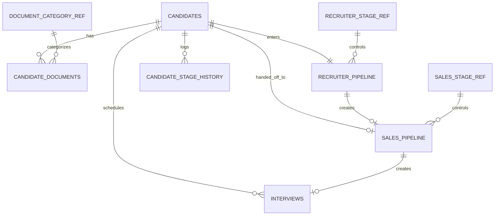
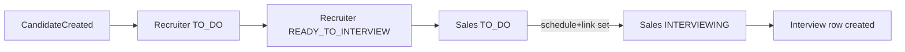

# MySQL Recruitment Schema Review

## Scope
This schema is designed for the current operational flow:

1. Super Admin can access all modules.
2. Recruiter creates and reviews candidate data.
3. Sales receives handoff from Recruiter.
4. Sales schedules interview data.
5. Interview Schedule stores operational interview records.
6. Role-based login is prepared for `SUPER_ADMIN`, `RECRUITER`, `SALES`, and `FINANCE`.

This proposal intentionally normalizes the current frontend model so that:
- candidate profile data is stored once
- recruiter and sales are separate process tables, not duplicated candidate records
- interview scheduling becomes a relational record tied to the same candidate
- roles and login are ready for backend implementation later

## Current Domain Mapping

### Frontend sources
- `src/types/recruiter.ts`
- `src/types/sales.ts`
- `src/types/interview.ts`
- `src/utils/recruitmentFlow.ts`
- `src/store/interviewsSlice.ts`

### Existing frontend entities

| Frontend area | Current shape | Main issue |
|---|---|---|
| Recruiter | candidate profile + recruiter stage + documents | profile duplicated in other modules |
| Sales | same candidate profile copied again + sales stage + interview link/schedule | duplicated profile and documents |
| Interview Schedule | separate interview record | not strongly linked to recruiter/sales candidate in a normalized way |
| Auth / roles | not implemented yet | needs relational base |

## Recommended Normalized Entities

### 1. Identity and access
- `users`

### 2. Candidate core
- `candidates`
- `candidate_documents`

### 3. Operational process
- `recruiter_pipeline`
- `sales_pipeline`
- `interviews`
- `candidate_stage_history`

### 4. Reference tables
- `document_category_ref`
- `recruiter_stage_ref`
- `sales_stage_ref`

## Why this shape

### Single source of truth for candidate data
The frontend currently stores candidate profile data in both recruiter and sales records. In MySQL, candidate profile fields should live in `candidates`, while recruiter and sales keep only process-specific fields.

### Separate pipeline tables
`Recruiter` and `Sales` are business stages, not different candidate identities. Using `recruiter_pipeline` and `sales_pipeline` keeps the workflow explicit while preserving one candidate record.

### Interview as an operational child record
Interview scheduling is created after sales processing. Therefore `interviews` should be its own transactional table, related to both:
- `candidates`
- optionally `sales_pipeline`

### Role model prepared for login
For the first version, `users.role` as `ENUM` is enough because the current business roles are fixed:
- `SUPER_ADMIN`
- `RECRUITER`
- `SALES`
- `FINANCE`

This keeps the schema simpler and easier to import/review early. If one user needs multiple roles later, the design can be upgraded into `roles` and `user_roles`.

## Recommended Table Overview

| Table | Purpose |
|---|---|
| `users` | login identity and profile |
| `candidates` | main candidate profile |
| `candidate_documents` | uploaded candidate files |
| `recruiter_pipeline` | recruiter stage and ownership |
| `sales_pipeline` | sales stage, interview scheduling data, and handoff status |
| `interviews` | interview schedule records shown in Interview Schedule module |
| `candidate_stage_history` | audit trail of stage changes |
| reference tables | recruiter stage, sales stage, and document category consistency |

## Main Relationship Model

## Stage and Role Model

### Roles
Stored directly in `users.role`:
- `SUPER_ADMIN`
- `RECRUITER`
- `SALES`
- `FINANCE`

### Recruiter stages
- `TO_DO`
- `READY_TO_INTERVIEW`
- `INTERVIEWING`

### Sales stages
- `TO_DO`
- `INTERVIEWING`

### Interview candidate status
Stored directly in `interviews.candidate_status` as `ENUM`:
- `INTERVIEW`
- `BACKOUT`
- `RESCHEDULE`

### Interview process status
Stored directly in `interviews.interview_status` as `ENUM`:
- `PROCESS`
- `FAILED`

## Suggested Lifecycle

## Column Design Notes

### `candidates`
Holds stable profile fields:
- full name
- applied role
- email
- phone
- source
- location
- expected salary
- date of join
- profile summary
- photo metadata

### `candidate_documents`
Stores many files per candidate:
- category
- file name
- mime type
- size bytes
- storage path or URL

### `recruiter_pipeline`
Stores recruiter-specific process fields:
- recruiter stage
- assigned recruiter user
- handoff timestamp
- lock flag after handoff

### `sales_pipeline`
Stores sales-specific process fields:
- sales stage
- assigned sales user
- interview schedule
- interview link
- related interview record
- processed timestamp

### `interviews`
Stores interview schedule data:
- candidate
- schedule datetime
- meeting link
- owner
- host
- candidate status as enum
- interview status as enum
- notes

## Important Design Decisions

### Keep process data separate from profile data
This avoids sync bugs like the frontend currently handles with:
- `syncRecruiterCandidateFromSales()`
- `syncSalesCandidateFromRecruiter()`

### Keep role storage simple for version one
Because current access needs are straightforward, storing role directly in `users.role` is enough and avoids overengineering.

### Use reference tables only where they add value
For the current version:
- recruiter stage remains in a reference table
- sales stage remains in a reference table
- document category remains in a reference table
- interview statuses are simplified into `ENUM` because they are fixed and not configurable from the website

### Use `candidate_stage_history` for auditability
This allows you to answer:
- who moved candidate from recruiter to sales
- when sales processed candidate
- when interview record was created

### Keep `Finance` only in auth for now
There is no finance module data model yet in frontend. The schema prepares the role, but does not create a finance process table until business flow is defined.

## Out of Scope for this first schema draft
- refresh tokens / session tables
- permissions matrix per menu
- notification tables
- master report final reporting mart
- finance operational tables

These can be added later without redesigning the core candidate workflow.

## Recommended Review Checklist

Please review these items:

1. Are role names correct: `SUPER_ADMIN`, `RECRUITER`, `SALES`, `FINANCE`?
2. Is one `candidate` row per person the right business rule?
3. Should recruiter and sales each have exactly one active pipeline row per candidate?
4. Is one sales pipeline expected to create only one interview record, or could it create multiple?
5. Should `owner` and `host` in interviews remain free text, or must they become `users` references only?
6. Is `Finance` only a role for now, or should it also get a future process table soon?

## Files Delivered
- `docs/database/mysql_recruitment_schema_review.md`
- `db/mysql/recruitment_schema.sql`
